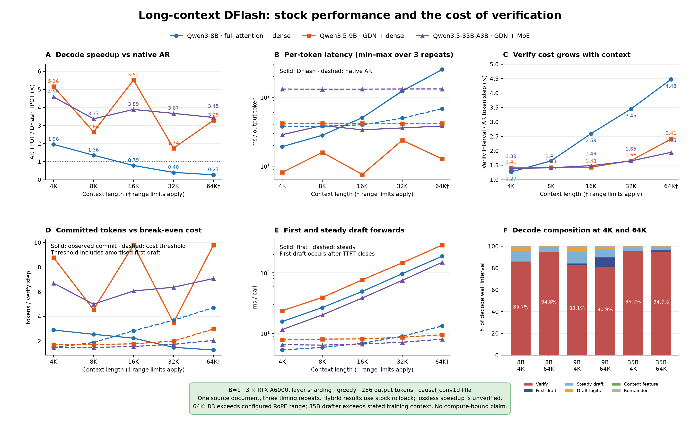
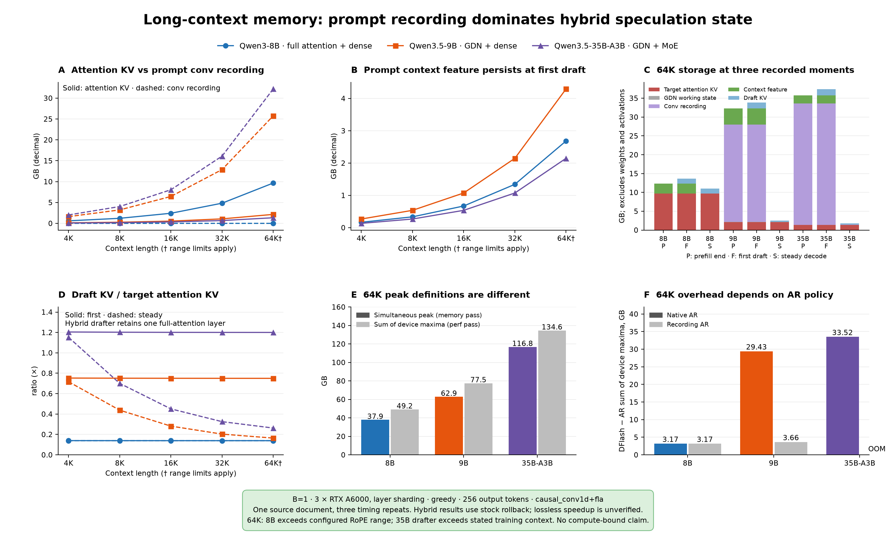
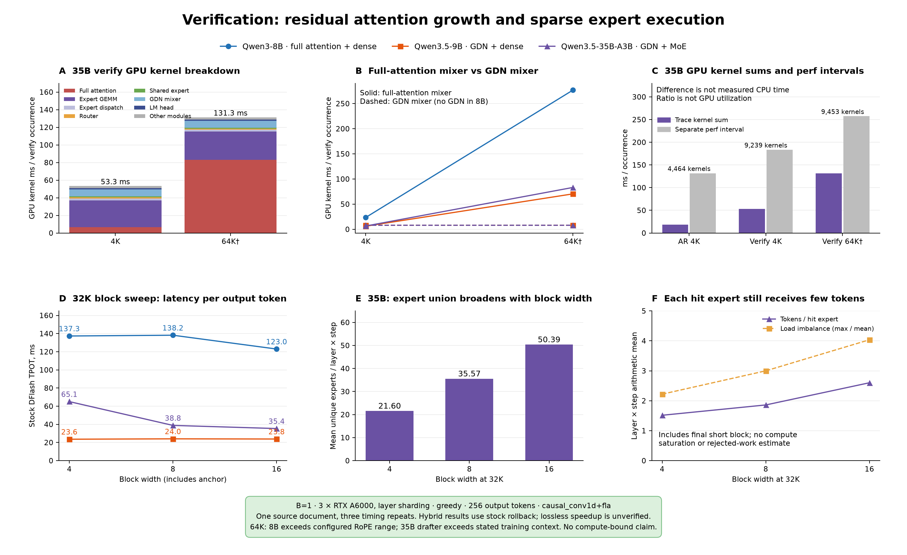
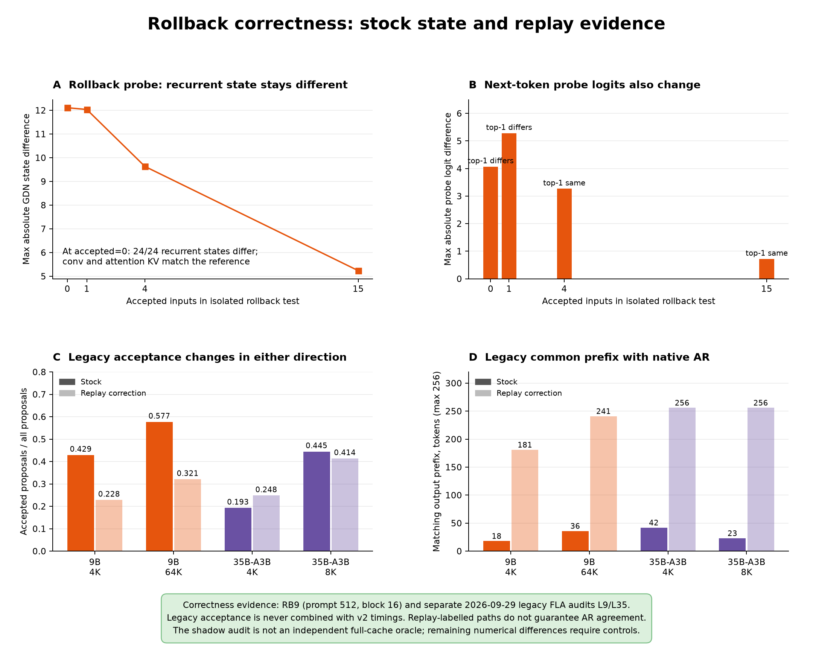

# Long-context profiling and DFlash research results

**All-context phase figures:** [PHASE_VISUALIZATION.md](PHASE_VISUALIZATION.md)
contains phase memory, DFlash/native AR wall latency, target module execution,
steady draft kernel costs, and D4 verification overhead for **all three models
at 4K, 8K, 16K, 32K and 64K**, with numerical tables and CSVs.

Visualizations of [LONG_CONTEXT_BOTTLENECK_REPORT.md](../LONG_CONTEXT_BOTTLENECK_REPORT.md)
and [DFLASH_ARCHITECTURE_RESEARCH_REPORT.md](../DFLASH_ARCHITECTURE_RESEARCH_REPORT.md),
generated directly from their cited JSON records, run-specific component CSVs,
routing CSVs and trace breakdowns. Layout, model colors, component colors and
green interpretation boxes follow the code in `visualization_selective/`.
Purple extends the palette to Qwen3.5-35B-A3B.

## Figures

Each image has a PDF with the same basename for export.

### Performance



- Decode speedup and per-token latency, including min–max timing ranges over
  three repeats. Solid latency curves are DFlash; dashed curves are native AR.
- Verify cost relative to an AR token step separates execution cost from
  nonmonotonic acceptance. Full acceptance rates are in the performance CSV.
- Observed committed tokens per step against the break-even cost threshold:
  `decode_latency / verify_steps / AR_TPOT`. This includes first-draft setup
  amortization. At 64K the observed/threshold pairs are approximately
  1.275/4.721 (8B), 9.808/2.978 (9B), and 7.083/2.055 (35B).
- First vs steady draft calls and decode composition. First draft is measured
  after TTFT closes; it is not part of the reported TTFT. Composition uses
  perf-pass interval timers, with a closing remainder computed from the same
  median row. Independently reduced field medians need not add exactly to the
  record's separately reduced unattributed-time median.

8B drops below native AR speed at 16K. Hybrid stock speedups remain above 1×,
but their lossless decoding performance has not been established.

### Memory



- Attention KV and prompt conv recording scale differently across the three
  targets. At 64K, recording is about 12× target attention KV in 9B and 24× in
  35B; it is an implementation cost of prompt recording, not an inherent GDN
  requirement.
- Prompt features reach 2.68/4.30/2.15 GB for 8B/9B/35B.
- P/F/S columns use the exported component snapshots at prefill end, first
  draft and steady decode. They exclude weights and activation allocations;
  they are not decompositions of the whole-process peak. Conv recording and
  prompt features collapse before the steady snapshot. These three moments
  do not describe every intervening allocation or its exact release time.
- Draft KV relative to target attention KV distinguishes first and steady
  state. The hybrid drafter retains one full-attention layer, so its entire
  steady KV is not bounded independently of context length.
- Simultaneous memory-pass peak and perf-pass sum of per-device maxima are
  shown separately. All main runs peak at a target prefill layer: 35/30/39
  for 8B/9B/35B, respectively. Per-device maxima can occur at different times.
- Overhead uses the **difference of sums of device maxima**, relative to
  native or recording AR. The original 35B/64K recording-AR control was OOM;
  it is marked as missing, not replaced with the allocator-control result.

### Verification and MoE



- 35B verify kernel breakdown at 4K and 64K, and full-attention/GDN mixer
  kernel growth across models. Full-attention mixer totals include its
  projections and copies as classified in the breakdown, not just attention
  kernels. Mixer totals are sums over all corresponding target layers.
- GPU kernel sums and separately measured perf intervals are grouped bars,
  never stacked into an invented host/GPU time decomposition. Kernel counts
  show why host/launch cost merits investigation.
- At 32K, block 4→16 changes 35B TPOT from 65.1 to 35.4 ms, while 8B and 9B
  change much less. All three 35B block points use R35B, including block 16;
  R35's sequence-sweep 32K point is a different run.
- MoE union grows from 21.60 to 50.39 experts/layer, while average tokens per
  hit expert only grows from 1.515 to 2.601. Both are arithmetic means over
  layer×step rows, including the final short block. Tokens per hit expert is
  computed per row as `num_tokens * top_k / unique_experts_hit`; the CSV's
  `tokens_per_expert_mean` has a different denominator.

**Trace total convention:** `*.breakdown.json` reports GPU kernels, excluding
memcpy events. Its sums are approximately 53.3/131.3 ms for 35B verify at
4K/64K. The reports' 54.4/132.7 ms device totals include additional copy events.
Neither divided by perf wall time is GPU utilization: passes, step ranges and
profiler overhead differ. The gap is not measured CPU launch time. No hardware
counter evidence establishes a bandwidth-to-compute transition.

### Correctness evidence



The isolated RB9 rollback probe uses prompt 512, block 16 and the segmented
reference. At accepted=0, conv and attention KV match, but all 24 recurrent
states differ; the maximum state difference is 12.10845 and logit difference
is 4.07031. Accepted=0 here is a standalone rollback test, not a production
commit length including the anchor.

L9 (4K/64K) and L35 (4K/8K) are earlier FLA audits, shown separately. Replay
correction can increase or decrease acceptance. Common prefix is the number
of matching output tokens before first divergence; 256 means the full output
matches. The `exact` pass label alone does not guarantee AR agreement, and the
shadow audit is not an independent full-cache oracle. These acceptance values
are never mixed with the v2 timings to predict corrected speedup.

## Reproduce

From the repository root, using the existing environment with Matplotlib and
NumPy:

```bash
/home/seoyounglee/venvs/dflash-fla/bin/python visualization_long_context/plot_results.py
```

This is CPU-only plotting; it does not run new GPU experiments or modify the
records. Inputs are pinned to R8/R9/R35/R35B and the cited correctness records.
The loader checks protocol v2, three GPUs, 256 output tokens, clean timing
passes and native AR without a resident drafter. No package install is needed
in the existing environment.

| Output | Contents |
| --- | --- |
| `performance_metrics.csv` | 15 model/context rows; latency, acceptance, commit threshold, phase shares and both peak definitions |
| `block_metrics.csv` | 9 model/block rows at 32K |
| `memory_components.csv` | Original component snapshot fields and units, with moment and condition keys |
| `trace_metrics.csv` | Model/context/mode kernel breakdown, counts and separate perf intervals; missing trace exports omitted |
| `moe_routing_metrics.csv` | 35B block routing means and number of contributing layer×step rows |
| `rollback_metrics.csv` | Segmented GDN rollback probe rows |
| `legacy_correctness_metrics.csv` | Earlier acceptance, common prefix and incremental rejecting-step state error |
| `sources.json` | Exact input files and source reports |

Main experiments use B=1, greedy, block 16, output 256, three RTX A6000 GPUs
with layer sharding, and `causal_conv1d+fla`. There is one source document,
extended for longer contexts, and three timing repetitions. Those repetitions
measure timing variability, not workload generality. At 64K, 8B exceeds its
configured 40960-position range and 35B exceeds its drafter's stated training
context. These points support measured memory/kernel observations but do not
isolate an architecture-specific acceptance effect. Hybrid curves describe
the stock implementation with the documented recurrent restoration defect.
